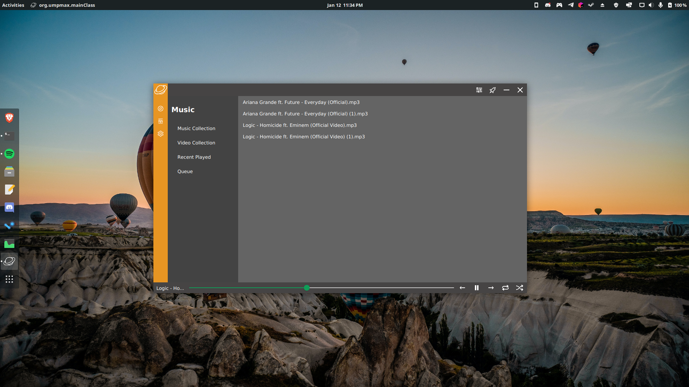
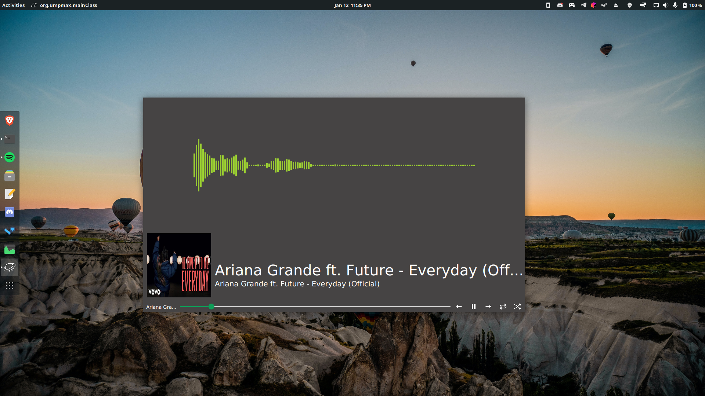
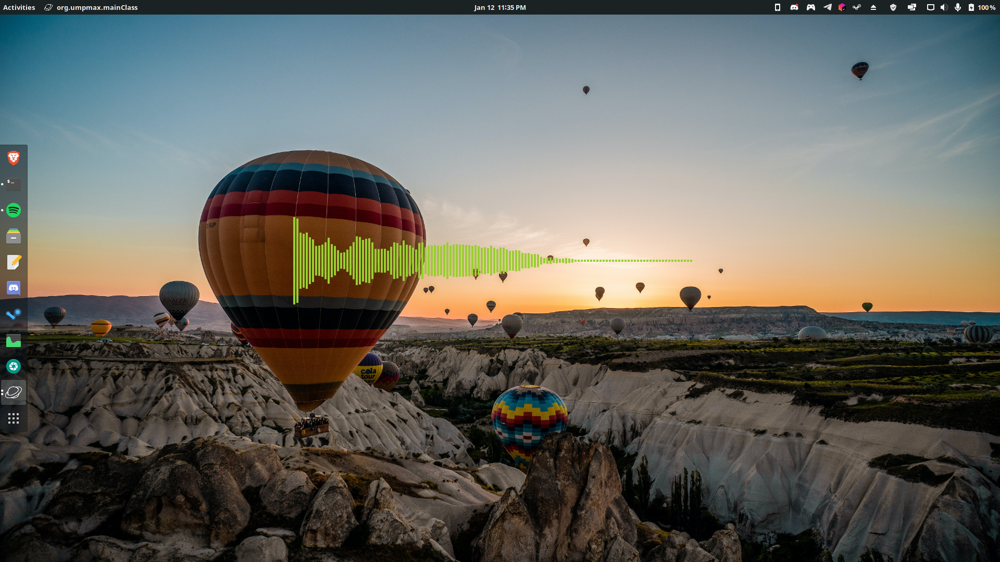
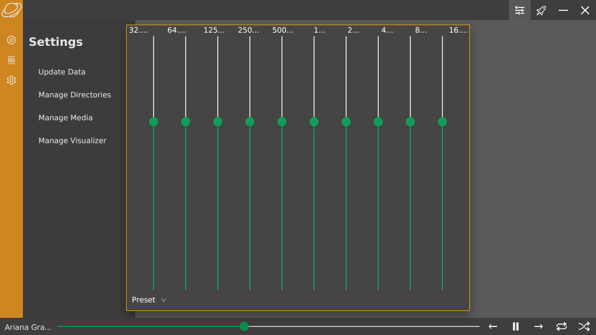
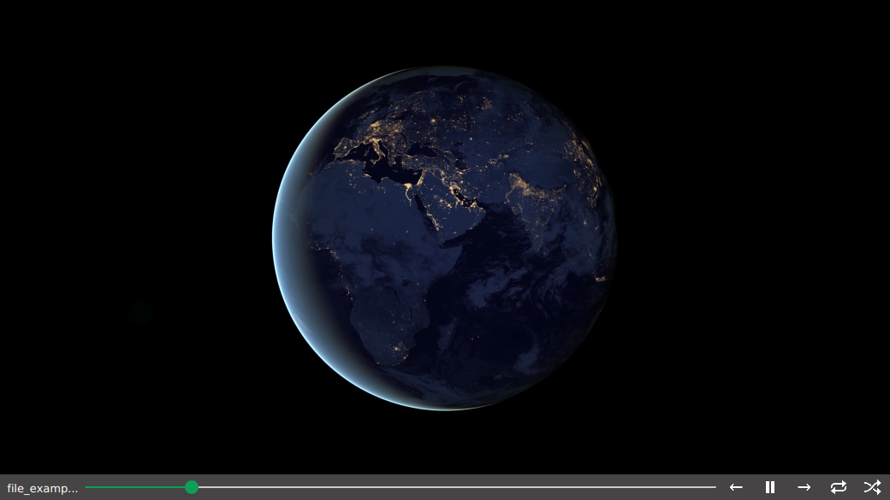

# UmpMax
A Media player made in JavaFX

> This project is stale. The codebase dates back to 2016 when I was 13. So obviously, the code quality is awful.

## Features
+ Visualizer
+ Equalizer
+ Playlist
+ MetaData

## Running

[Click here to download linux release](https://github.com/aniketfuryrocks/UmpMax/releases/tag/0.0.1)

Windows and Mac users have to compile it using maven.
`mvn clean compile javafx:jlink`

# Screen Shots

